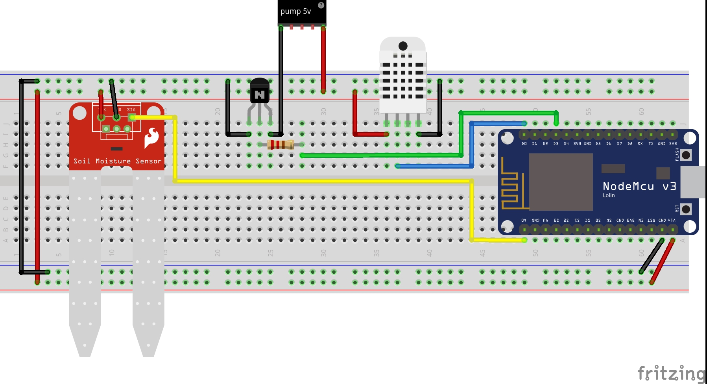

# Serra Automatizzata


This program uses Adafruit IO to graph the sensors value.  

Remember to change the following parts:  
```
/************************* WiFi Access Point *********************************/

#define WLAN_SSID       "Wifi_name"
#define WLAN_PASS       "wifi_password"

/************************* Adafruit.io Setup *********************************/

#define AIO_SERVER      "io.adafruit.com"
#define AIO_SERVERPORT  1883                   // use 8883 for SSL
#define AIO_USERNAME    "xxxx"
#define AIO_KEY         "yyyy"
```

  